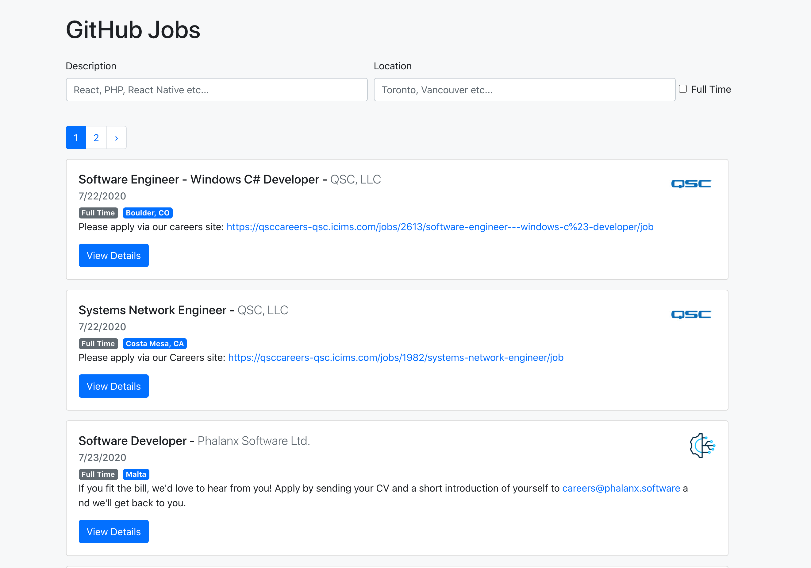

# GitHub Jobs App

---

### About:

This App getting the data from GitHub Job APIs and displays the jobs available in GitHub Job portal. You can filter the job by description, location and type of job like full time or part time.

## Technoloogies used:

- React
- useState Hooks
- useReducer Hooks
- Reducer
- React - Bootstrap
- Git

## Software used in this Project:

- Visual Studio Code
- GitHub
- Google Chrome Developer Tools

## How to use it:

- Please download or clone the repository
- In the App dirctory, run this command (npm install)

## Developed by:

Alam Talash
https://alamtalash.com

#### Date: July 24, 2020
